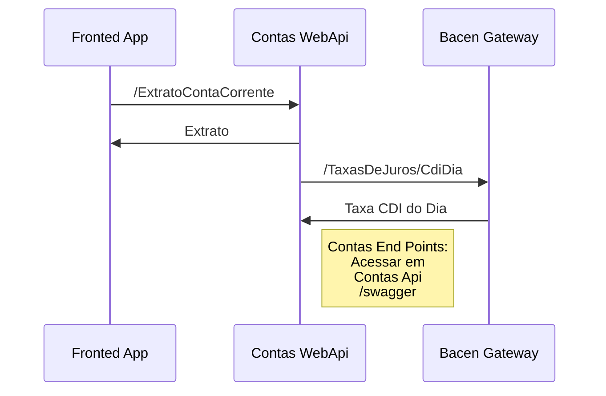

# Brka-App
 Sistema de controle de conta corrente que rende 100% do CDI

## Requisitos
- Dotnet Core SDK - 3.1.402  
- yarn - 1.22.5  
- Docker e Docker Compose (19.03.6) ou MySql (8.0.21)  
- Vue/Cli - 4.5.6  
- Quasar/Cli - 1.1.0  

 ## Tecnologias implementadas
 - ASP.NET Core 3.1  
 - Quartz (Cria JOB para rentabilizar conta corrente)  
 - Swagger UI 5  
 - Entity Framework Core  
 - Axios  
 - VueJs  
 - Quasar Framework  

## Fluxo Arquitetura  

## Para rodar este projeto