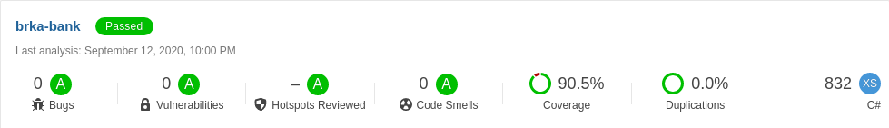
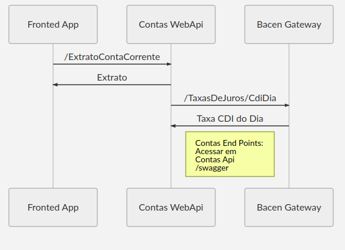
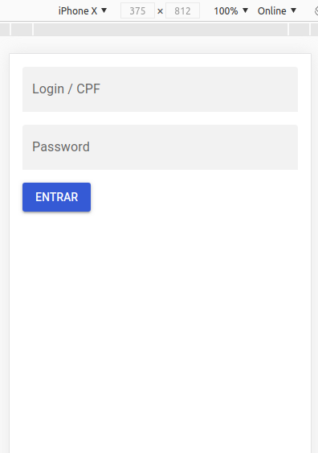
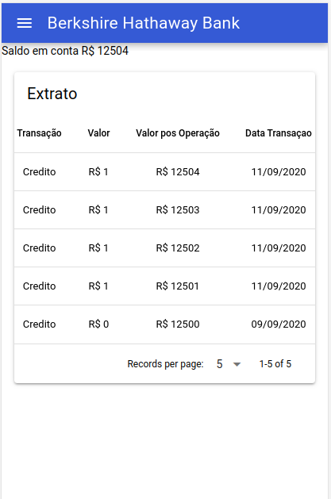
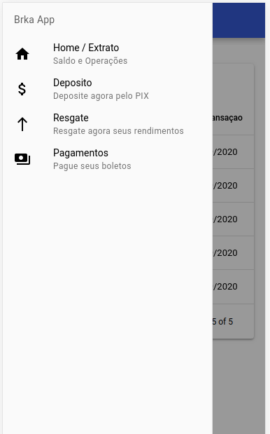
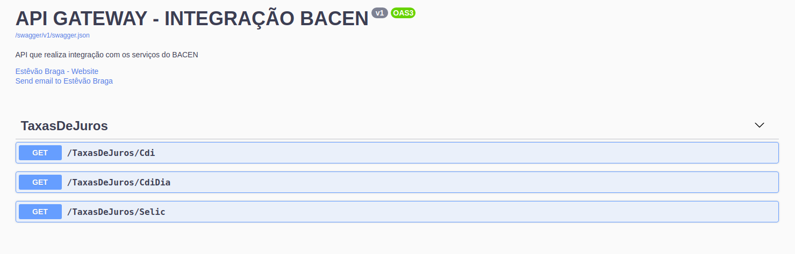
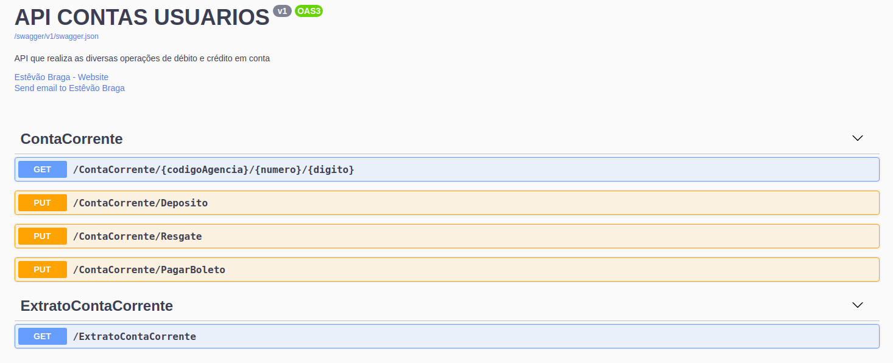

# Brka-App
 Sistema de controle de conta corrente que rende 100% do CDI

## Requisitos
- Dotnet Core SDK - 3.1.402  
- yarn - 1.22.5  
- Docker e Docker Compose (19.03.6) ou MySql (8.0.21)  
- Vue/Cli - 4.5.6  
- Quasar/Cli - 1.1.0  
Os testes de integração requerem base de dados MySQL configurada conforme o [primeiro passo para rodar este projeto](###1---Iniciar-Base-de-Dados-MySql)  

 ## Tecnologias implementadas
 - ASP.NET Core 3.1  
 - Quartz (Cria JOB para rentabilizar conta corrente)  
 - Swagger UI 5  
 - Entity Framework Core  
 - Axios  
 - VueJs  
 - Quasar Framework  

## Fluxo Arquitetura  

## Para rodar este projeto:  

### 1 - Iniciar Base de Dados MySql
- Na raiz do repositório rodar o comando:  
`docker-compose up -d`  
Ou possuir base de dados MySQL, requer modificação da variável `DataBaseConf.ConnectionString` em `appsettings.Development.json`  
- Executar script sql (`dbScript/EFMigration.sql`) na base de dados 

### 2 - Iniciar Bacen Gateway Api
Na pasta `BacenGateway/Brka.Bank.BacenGateway.WebApi`  
Executar  
`dotnet restore`  
`dotnet run`  

### 3 - Iniciar Contas Api
Na pasta `src/Conta/Brka.Bank.Contas.WebApi`  
Executar  
`dotnet restore`  
`dotnet run`  

### 4 - Iniciar Fronted App
Na pasta `src/Apresentacao`  
Executar  
`yarn install`  
`quasar dev`  
  
Ao acessar fronted deve obter:  
  
Rota ( / )  

Rota ( /home )  

Rota ( /home#menu )  

## Swagger Apis  

### Contas Apis  
  

### Bacen Gateway  
  